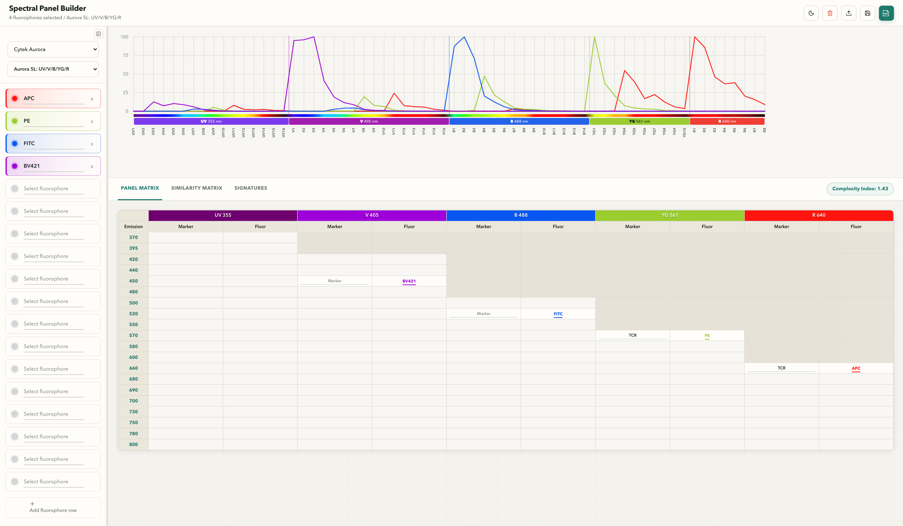

# openpanel

`openpanel` is a standalone R package for interactive spectral flow cytometry
panel design. It is extracted from Spectreasy's spectral panel builder and
preserves the same browser interface, packaged theoretical spectra, panel
metrics, CSV import/export, and PDF overview export.

Supported cytometers:

- Cytek Aurora
- BD FACSDiscover
- Sony ID7000
- Thermo Fisher Attune Xenith

## Install and launch

```r
# remotes::install_github("pkheisig/openpanel")
openpanel::build_panel()
```

The installed package serves its bundled browser assets locally. No data is
uploaded.



For frontend development, install the JavaScript dependencies once and launch
with Vite:

```sh
cd inst/gui
npm install
```

```r
openpanel::build_panel(dev_mode = TRUE)
```
